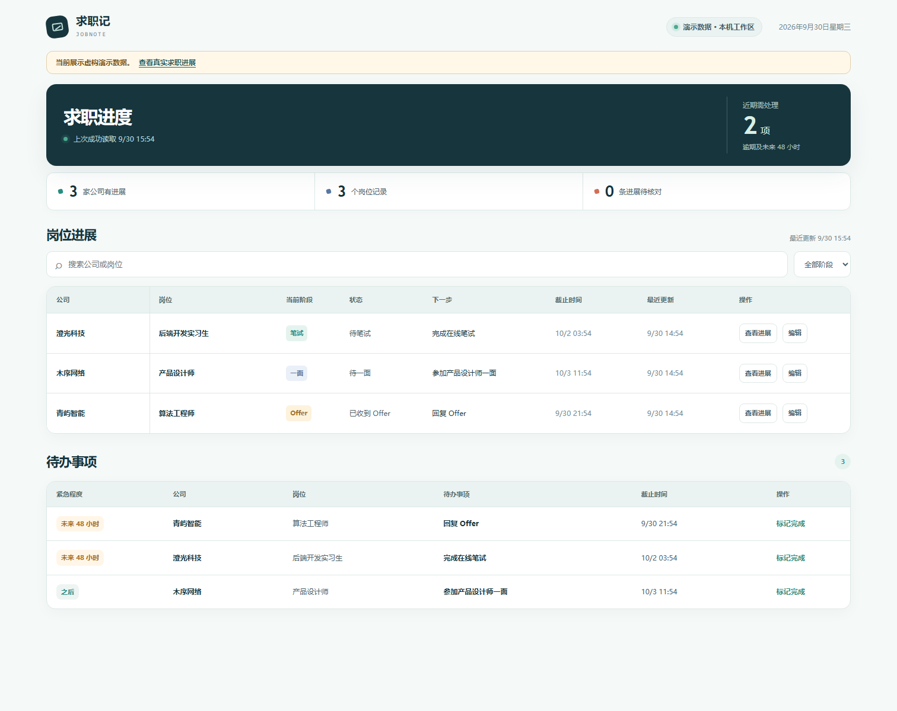

# 求职记 · JobNote

把散在邮箱里的招聘进展，整理成一张看得懂的求职表：**哪个公司、哪个岗位、走到哪一步、接下来要做什么。**



*截图仅使用虚构演示数据。*

## 能做什么

- **看进展：** 按公司和岗位汇总投递、测评、笔试、AI 面试、一面、二面、三面和 Offer；状态会显示“待笔试”“待一面”等。
- **管待办：** 把测评、笔试、面试和回复事项放进待办表，显示截止时间与紧急程度；每 4 小时可向微信发送一份摘要。
- **核对来源：** 每条进展保留邮件证据。公司、岗位或面试轮次不明确时，直接在表格中核对或忽略，不替你猜。

`腾讯企业邮箱 → 千问办公定时整理 → 本机网页 + 微信摘要`

目前是**本机单用户预发布版**：支持一个腾讯企业邮箱收件箱，复用本机 [`qqexmail` 技能](docs/QQEXMAIL_REFERENCE.md)。千问办公负责定时整理，并通过已连接的微信 IM 频道发送结果。Gmail、普通 QQ 邮箱和教育邮箱尚未接入。

## 先看演示

需要 Node.js 22.13+。演示无需邮箱账号，数据均为虚构。

```powershell
git clone https://github.com/wind127/jobnote.git
cd jobnote
npm ci
npm run demo
```

打开 <http://127.0.0.1:3211>。

## 接入自己的邮箱

先安装并配置 `qqexmail` 技能，再在项目目录执行：

```powershell
npm run build
Copy-Item .env.example .env
```

在 `.env` 中填写技能目录、腾讯企业邮箱账号和客户端授权码。然后运行：

```powershell
node --env-file=.env dist/cli.js doctor
node --env-file=.env dist/cli.js serve
```

打开 <http://127.0.0.1:3210>。接着按照[千问办公定时任务说明](docs/QWENWORK_TASK.md)，建立一项每 4 小时运行的任务，并将任务结果指定发送到已连接的微信 IM 会话。邮件读取为只读模式，网页和记录保存在本机；摘要由千问办公转发到微信。

## 当前进度

真实邮箱只读读取、本机岗位进展与待办展示已验证；**每 4 小时无人值守运行及真实微信送达尚待联调**。详见[验证记录](docs/VALIDATION.md)。

更多资料：[产品与工程规格](SPEC.md) · [独立评审](docs/INDEPENDENT_REVIEW.md) · [qqexmail 接入](docs/QQEXMAIL_REFERENCE.md)。开发检查：`npm run check`、`npm test`。

`.env` 和 `data/` 不会提交到 GitHub；请勿上传自己的邮件内容或密钥。项目采用 [MIT 许可](LICENSE)，`qqexmail` 技能由用户自行安装，未包含在仓库中。
