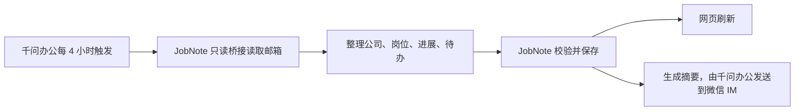

# 求职记 · JobNote 产品与工程规格

| 项目 | 内容 |
| --- | --- |
| 文档版本 | 0.2.2（大邮件正文读取） |
| 更新日期 | 2026-09-30 |
| 状态 | 本地程序与网页已实现；真实邮箱抽样读取通过，定时任务和微信到达待联调 |
| 使用方式 | 本机单用户，复用千问办公桌面端与现有 qqexmail 技能 |

## 1. 产品目标与范围

每 4 小时自动查看招聘邮件，把各公司、各岗位的进展刷新到网页，并将待办摘要推送到微信。

本版依据用户确认，固定以下分工：

| 环节 | 实现方式 |
| --- | --- |
| 定时触发 | 千问办公桌面端定时任务，每 4 小时一次 |
| 邮件读取 | JobNote 只读桥接程序，复用本机 `qqexmail` 技能安装的 IMAP 与邮件解析依赖 |
| 邮件理解 | 千问办公使用现有模型整理为规定的数据格式 |
| 保存与展示 | JobNote 本地程序校验、去重、保存，网页读取同一份数据 |
| 微信推送 | JobNote 根据已保存结果生成摘要；千问办公定时任务将结果发送到指定微信 IM 会话 |

首版只交付：读信、公司/岗位进展、待办、网页、微信摘要，以及这些功能必需的去重和错误提示。

移出当前范围：多邮箱管理、Gmail/Microsoft/Agent Mail 接入、QQ 及其他通知渠道、邮件文件导入、独立投递管理、数据导出、统计分析、附件识别、多用户账户系统。原有独立调度、PostgreSQL、队列服务和多服务部署方案一并移除，不保留为首版预留任务。

## 2. 完整流程

每次任务按以下顺序执行：

1. 从本地程序取得本轮编号、上次读取位置、已有岗位和未完成待办。
2. 通过本地只读桥接入口取得尚未处理的邮件及完整正文，暂存本批原始来源供校验，再交给千问办公整理。首次读取最近 30 天，固定起点保存于数据库。
3. 千问办公识别招聘相关邮件，提取结构化结果；普通通知和职位推广不创建求职进展。
4. 本地程序校验来源与字段，去重后保存邮件记录、岗位变化、待办和读取位置。
5. 网页读取最新结果，展示本次更新时间和处理状态。
6. 本地程序从已保存的数据生成一份摘要，千问办公把任务结果发送到指定微信 IM 会话。

网页和微信共用同一份已保存结果。千问办公不直接改数据库，不另写一份与网页不同的推送内容。

## 3. 网页

首版只有一个主页面，详情在页面内展开。

### 3.1 公司与岗位进展

使用可横向滚动的表格，每个已确认岗位单独一行。默认按阶段进展从后到前排序；同阶段先按内置企业名单优先级排序，再将已确认记录排在 AI 核对记录前，其余按最近更新时间排序。流程结束的记录排在最后。企业名单是可编辑的展示优先级，不代表对公司质量的评价。阶段用彩色标签和轻量分隔线区分；AI 核对中的邮件按公司和阶段在主表收起，可展开查看原文依据，不要求用户逐条确认。

| 公司 | 岗位 | 当前阶段 | 状态 | 下一步 | 截止时间 | 最近更新 | 操作 |
| --- | --- | --- | --- | --- | --- | --- | --- |
| 示例科技 | 后端实习生 | 笔试 | 已邀请 | 完成在线笔试 | 10 月 8 日 20:00 | 10 月 6 日 09:00 | 查看进展 |

以上为虚构示例。页面支持公司/岗位搜索和阶段筛选；待 AI 核对的邮件列入岗位表，模型依据原文决定关联、忽略或等待更多证据。窄屏下表格横向滚动。打开岗位详情可查看进展时间线、邮件主题、发件人、收件时间和对应原文片段。演示页显著标明虚构数据并链接正式页；正式页在首轮读取未完成时提示历史邮件仍待处理。

展示阶段包括：投递、简历筛选、测评、笔试、AI 面试、一面、二面、三面、Offer、流程结束。选择器不提供“面试”或“其他”；邮件未注明面试轮次时显示“轮次待核对”，不猜测具体轮次。待进行的事项以“待测评”“待笔试”“待AI面试”“待一面”等状态显示；预约细节在编辑选项中保留。并行事项同时显示，不计算虚构的完成百分比。

### 3.2 待办与运行状态

- 待办以表格展示，按逾期、未来 48 小时、其他未完成、时间待核对排序。
- 每行显示紧急程度、公司、岗位、要做的事、截止时间和操作；允许标记完成或撤销完成。岗位归属待 AI 核对的事项也出现在此表，显示模型处理状态。
- 无法确定公司、岗位或时间时显示“AI 核对中”；模型没有充分证据时显示“等待更多证据”，不猜测具体内容。
- 顶部显示最后成功读信时间、本轮处理结果；超过 4 小时没有成功读信时提示数据可能未更新。
- 失败邮件在运行状态区列出来源、已取得的主题、失败原因和重试入口；对持续失败的单封邮件允许用户明确选择“跳过并继续”，保留决定和原因。被跳过项仍可见，可单独重试，不算作成功读取或普通邮件。
- 页面打开后每 30 秒查询一次版本，有变化时刷新；不需要实时通信服务。
- 定时计划的启停和立即执行统一在千问办公中操作，网页不再提供第二套调度管理。

## 4. 邮件整理规则

### 4.1 必要字段

每条整理结果包含：邮件来源、公司、岗位、阶段、具体状态、面试轮次（如有）、事件时间、待办描述、开始/截止时间（如有）、对应原文、是否待核对。

字段缺失保留为空。时间同时保留原文；明确时刻存 UTC 并以 Asia/Shanghai 展示，只有日期时保留日期精度。相对时间仅在邮件写清基准时计算；“48 小时内”基准不明时标为待核对，不擅自按本次任务时间起算。

### 4.2 归档与更新

- 同公司不同岗位分别展示。项目先用申请编号和明确岗位匹配已有记录；邮件未写岗位时，只有同公司恰好一个已确认岗位、且没有其他岗位的冲突通知，才自动关联。多岗位或信息冲突时进入 AI 核对队列，并显示原因。
- 不同申请编号分别建档。岗位同名但无法判断是否同一次申请时，保留待核对，不自动合并。
- 收到测评、笔试或面试邀请，只表示收到邀请；完成和通过分别记录。
- 第一封邮件就是面试邀请时，保留已知事实，不补造之前的投递和通过记录。长期无邮件不推断淘汰。
- 同一场次的提醒、补发和明确改期更新原事项，不重复创建待办；不能确定场次时进入待核对。
- 每批邮件提交后以及网页启动时，项目先用确定性规则重新匹配已确认岗位。剩余邮件与用户导入的表格记录进入持久化 AI 核对队列；千问办公定时任务读取原文、同公司候选岗位及最近证据，提交带原文引用和具体理由的决定。模型可关联岗位、拆分有明确依据的多岗位记录、忽略重复，或标记“等待更多证据”；不能凭常见招聘流程猜测缺失事实。对相近通知仍按公司、岗位、阶段、轮次和申请编号汇总展示，历史邮件保留为独立事件。AI 决定及证据引用保存在本机，重复提交不重复更新。
- 旧邮件补入时间线，不仅凭本次读取顺序覆盖新状态。取消单场面试不推断整次申请被拒绝。
- 人工修正和已完成状态持久保留，重复读信不得覆盖。新邮件与人工结果冲突时展示待核对。
- 每封邮件可以产生多条结果；每条必须关联具体来源和证据。正文缺失、格式不合法或证据片段不存在时，不自动更新岗位状态。
- 邮件正文作为待分析内容处理，其中的指令不能改变任务流程、执行程序或触发额外外发。

## 5. qqexmail 复用

### 5.1 使用约定

通过配置 `QQEXMAIL_SKILL_DIR` 指向已有技能，首版只处理该技能已配置的一个腾讯企业邮箱的 INBOX。

- 原技能脚本保持不变；JobNote 通过技能目录加载已安装的 `imap` 与 `mailparser` 依赖，提供自己的只读分页入口。
- 凭据使用技能要求的 `EXMAIL_ACCOUNT`、`EXMAIL_AUTH_CODE`，在执行环境中提供。千问办公已有配置是否能用于每次定时执行，需要实际验证。
- 登录邮箱地址以本地配置保存，业务来源使用内部邮箱标识；授权码不进入网页、模型整理结果、日志或版本库。
- 读取显式只读，保留 TLS 验证。参数通过固定命令和参数数组传递，邮件内容不能成为执行命令。

### 5.2 为定时使用补齐的行为

现有技能已成功用于用户的交互读信，但其脚本不提供稳定的机器批处理接口。JobNote 在自身代码中实现以下桥接行为，保持原技能命令不变：

1. 增加机器可读输出和明确错误码，返回完整邮件来源信息。
2. 真正实现首次日期范围、UID 分批读取及后续增量读取，不能每次只取最近 10 封；单批默认 100 封，有下一批时继续读取。
3. 等待正文和邮件属性解析完成，不使用固定等待时间。
4. 显式只读打开邮箱；非法 UID、正文缺失和解析失败返回错误，不作为正文处理。
5. 整封邮件超过 2 MiB 时依据 MIME 结构仅读取可用的文本正文部分，不下载附件；无可用正文时保留失败记录。

首次范围按服务器收件时间确定，记录固定起点；每次扫描先固定本轮 UID 上界，按 UID 升序分批，新到邮件留到下一轮。读信入口持久保存本批来源清单、每项读取结果和页尾位置，模型只提交提取字段，不能更改清单、扫描边界或自行推进读取位置。

沿用该技能的认证变量、IMAP 地址和本地依赖，不再引入另一个邮件客户端依赖。原技能目录未修改，也未随开源仓库分发；已通过用户本机授权进行一次真实邮箱抽样读取，连续无人值守读取仍待验证。

### 5.3 去重与失败

- 邮件来源键为“邮箱身份＋INBOX＋UIDVALIDITY＋UID”。同一来源重复处理不重复创建进展和待办。
- 每批来源、整理结果和读取位置在同一事务保存；普通失败批次不推进读取位置。提交来源必须与本地批次清单一一对应；漏项、多项或重复来源均拒绝整批，不能因为剩余内容合法就推进读取位置。普通邮件也必须提交明确处理结果。
- 单封读取/解析失败立即保存为运行诊断，不推进业务读取位置。暂时性故障保留重试；持续失败项可以由用户明确跳过，程序核对已保存的跳过决定后，才允许该项与本批其他已处理项一起提交并推进位置。模型无权跳过；邮箱认证或整体连接失败不能按单封跳过。
- 跳过项持续显示为未处理缺口，网页和摘要保留缺口数量，直到该项单独重试成功；重试不回退正常扫描位置，结果仍按原来源去重。明确损坏、仅附件或远端已删除导致的正文不可用均适用，不能让单封邮件无限阻塞后续读取。未知但可读取的内容可保存为待核对。
- UIDVALIDITY 变化时停止沿用旧 UID，重读原配置日期范围；完整内容与 Message-ID 等来源属性一致才复用已有记录，疑似重复进入待核对。
- 读信失败保留网页已有结果，并显示最后成功时间；不能把失败解释成没有新邮件。
- 同一次任务分批处理后才生成摘要。部分失败时摘要注明未完整更新；下一轮从最后成功位置继续。

具体静态核查依据见 [qqexmail 接入说明](docs/QQEXMAIL_REFERENCE.md)。

## 6. 定时任务与微信

### 6.1 千问办公负责调度

只配置一个千问办公桌面端任务，每 4 小时执行第 2 节完整流程。本机时区设为 Asia/Shanghai，首次启用记录首个计划时点；暂停、恢复和手动执行均使用千问办公现有功能。调整首个时点时同步更新本地配置，频率保持 4 小时。

JobNote 提供本地命令入口，供宿主取得上下文、提交整理结果并生成摘要。命令校验数据和运行状态；模型负责提取事实，业务去重由程序执行，微信发送由千问办公 IM 频道完成。每轮开始分配运行编号，重复调用沿用该编号，不由模型随意生成不同编号绕过去重。

同一时刻只处理一轮；活动任务存在时拒绝启动另一轮。异常中断后先确认旧任务结束，再恢复未完成工作。程序不实现后台任务队列或自动抢占执行者。

千问办公桌面端调度需要本机保持运行和唤醒，关机/休眠错过的任务不会自动补执行；每轮消耗宿主 Credits。下一次成功运行从已保存的读取位置接续，并只发送当前摘要，不补发多份历史摘要。[千问办公官方定时任务说明](https://docs.qwenwork.cn/desktop/scheduled-tasks)

### 6.2 微信摘要

使用千问办公已连接的微信 IM 频道。在创建定时任务时，明确选择接收摘要的微信会话；仅连接频道不会让桌面创建的任务自动发往微信。[千问办公 IM 频道说明](https://docs.qwenwork.cn/desktop/im-channels)

每轮处理结束发送一份，内容按以下顺序生成：

1. 逾期未完成事项。
2. 未来 48 小时内的测评、AI 面试、笔试、面试和 Offer 回复。
3. 其他未完成事项及时间待核对提示。
4. 自上次生成摘要后新增的公司/岗位进展。
5. 本次更新状态和时间。

无新邮件时仍整理现有待办；无待办和新进展时发送简短状态。默认最多展示 10 条，余项显示数量。只发必要摘要，不发送完整邮件、授权码、验证码或面试私人链接。网页默认仅本机访问，因此摘要不放无法从手机打开的 localhost 链接。

`finish` 原子保存本时段摘要并返回 `should_send`、`title`、`body`。千问办公只把 `title` 和 `body` 作为任务最终回复，并依照任务设置投递到指定微信会话。JobNote 不直接调用微信或第三方推送接口，也无法从本地确认微信实际送达。

### 6.3 防重复与错误处理

- 按首个计划时点划分 4 小时时段，程序为每个时段只生成一份摘要。手动重跑可更新网页，但同一时段 `finish` 返回 `should_send:false`。
- 任务跨入下个时段时，旧时段只保存数据、不补发旧摘要；新时段按最新已保存数据生成。时段归属由程序判定。
- JobNote 无法获知微信投递结果。千问办公送达失败时，网页进展仍然保留；需要在千问办公任务记录与微信会话中核对，不宣称端到端恰好一次。
- 先手动验证一轮能读信、刷新网页并收到微信，再在千问办公中启用周期任务。此项是实施验收，本次不创建真实任务或发送消息。

## 7. 最小技术与数据方案

### 7.1 组件

| 组件 | 首版实现 |
| --- | --- |
| 网页 | HTML/CSS/TypeScript，单页面，按公司分组与详情展开 |
| 本地程序 | Node.js + TypeScript，提供网页服务和宿主调用的命令，共用业务函数 |
| 数据 | SQLite 单文件；事务保证去重、批次保存与摘要生成状态 |
| 读信 | JobNote 只读桥接，使用已安装 qqexmail 的依赖 |
| 提取 | 千问办公现有模型；固定输出格式并由本地程序校验 |
| 通知 | 千问办公定时任务结果发送到指定微信 IM 会话 |

网页服务默认仅监听 `127.0.0.1`，不建立公网入口。浏览器读写只接受本机同源请求，拒绝跨站写入，邮件文本转义展示。数据目录和秘密配置保留在本机，版本库只提交配置示例与合成邮件样例。本批原文用于核对提取证据，提交后清理，失败批次可重新读取；数据库保存必要证据片段，不保存完整邮箱副本。模型处理沿用千问办公自身的数据处理方式，不宣称模型离线运行。

### 7.2 保存的数据

| 对象 | 必需内容 |
| --- | --- |
| 邮件记录 | 来源键、Message-ID、主题、发件人、时间、内容摘要校验值、处理状态 |
| 岗位记录 | 稳定 ID、公司、岗位、申请编号（如有）、当前进展、更新时间、人工修正 |
| 进展记录 | 稳定 ID、岗位 ID、来源邮件、阶段/轮次、事件与时间、证据片段 |
| 待办 | 稳定 ID、岗位/进展 ID、动作、时间及原文、完成/取消状态 |
| 运行记录 | 本轮编号、读取位置、批次结果、更新时间、对应时段与生成的摘要 |
| AI 核对 | 邮件或表格来源、原文片段、模型决定、具体理由、逐字引用及处理状态 |

邮件结果首次成功保存时由程序分配稳定序号和 ID；已处理来源的重复提交返回原结果，不按模型新生成的顺序追加记录。跨邮件的提醒/改期按已有事项关联，关联不清晰时待核对。人工更改使用记录版本检查，避免被同时运行的任务覆盖。

宿主提交格式固定包含 `schema_version`、`run_id`、`batch_id`、`messages[]`；每封包含来源、处理类别和 `updates[]`，每条更新包含公司、岗位、阶段、状态、时间、待办、证据和待核对原因。程序先校验本地批次清单的完整覆盖，再校验字段类型、枚举和长度；非法批次整体拒绝，返回可定位的错误。跳过状态只取自用户已保存的决定，宿主不能自报跳过；尚未解决的读取失败不得通过提交。普通邮件也记录已处理，避免每轮重复分析。

## 8. 交付与验收

交付本地程序、配置示例、千问办公任务说明与自动化测试。真实账号的单次完整流程、网页、微信到达和连续定时任务仍需联调；文档中的设计能力不能替代实际验证。

| 编号 | 场景 | 完成标准 |
| --- | --- | --- |
| AC-01 | 通过现有技能读信 | 使用配置的 qqexmail 路径；读到列表和完整正文，已读状态不因读取改变 |
| AC-02 | 首次范围与大量新邮件 | 最近 30 天按范围读取；两轮之间超过 100 封也分批处理完整 |
| AC-03 | 重复执行、提交遗漏与中途失败 | 相同来源不重复建进展/待办；本地清单有 3 封而模型仅提交 2 封，或提交额外/重复来源时整批拒绝、位置不变；普通邮件须明确提交 |
| AC-04 | 正文解析与来源变化 | 解析超过 500 毫秒仍等到完成；无效 UID、缺正文、UIDVALIDITY 变化按第 5 节处理 |
| AC-05 | 公司与岗位归档 | 同公司多个岗位分别展示；归属不明显示待核对，推广和登录提醒不成为进展 |
| AC-06 | 阶段、改期与人工结果 | 邀请不等于完成或通过；并行待办、补发、改期和人工完成不会相互错误覆盖 |
| AC-07 | 网页与证据 | 公司/岗位、下一步、时间和邮件依据可见；数据保存后 30 秒内反映到已打开页面 |
| AC-08 | 微信摘要 | 摘要与数据库一致；排序、截断、无新邮件、无待办和更新失败均有明确结果 |
| AC-09 | 摘要重复与发送失败 | 同时段仅生成一份摘要；千问办公推送失败不丢网页进展，并由其任务记录排查 |
| AC-10 | 损坏邮件、暂时失败与字段错误 | 单封损坏/仅附件/远端删除可见且可重试；用户明确跳过后后续批次可继续，模型自报跳过无效，缺口持续可见；重试成功去重且不回退位置；非法字段或证据不更新业务 |
| AC-11 | 定时实际运行 | 千问办公保持运行、额度足够时，连续 24 小时六轮完成读信、网页更新和微信收件 |
| AC-12 | 暂停与恢复 | 宿主暂停期间不触发；错过时段后可接续读取，下一轮只发当前摘要 |
| AC-13 | AI 核对 | 用户上传的表格和归属不明邮件进入队列；模型必须引用来源原文，错误引用被拒绝；证据不足不建立虚构岗位；重复提交不重复更新 |

已知依据：用户已验证 WorkBuddy/QoderWork 的交互读信；本机技能与提供的 ZIP 一致，依赖可解析。JobNote 的本地程序、网页和合成场景测试已实现；真实邮箱抽样读取 3 封均得到可解析正文。尚未完成：千问办公无人值守执行及微信收件验证。

0.1.9 的精简设计及批次完整性、失败邮件规则曾经[独立评审](docs/INDEPENDENT_REVIEW.md)。本版根据已实现的只读桥接调整接入方式；该实现变更及真实联调尚未经过新的独立验收。
